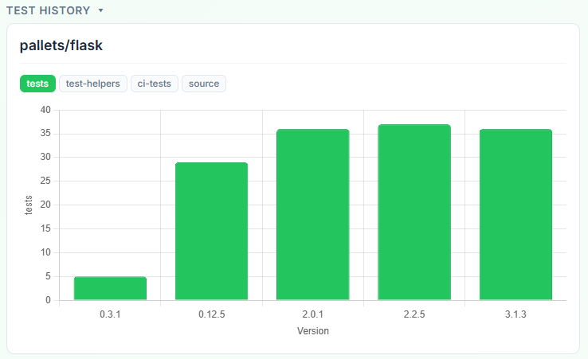

# Explorando Práticas de Teste

Neste exercício, vamos explorar práticas de teste em sistemas reais utilizando a ferramenta [TestMiner](https://andrehora.github.io/testminer).

O TestMiner permite visualizar e analisar testes de software em repositórios do GitHub, fornecendo dados sobre como os projetos organizam seus testes, como eles evoluem entre versões e quais bibliotecas de teste são utilizadas.
Explore a ferramenta antes de começar para se familiarizar com seu funcionamento.

---

## Passo 1: Selecionar um repositório

Escolha um repositório real que possua testes escritos na linguagem de sua preferência.
Abaixo estão alguns links para ajudá-lo a encontrar projetos interessantes:

- **Python:** https://github.com/topics/python?l=python
- **JavaScript:** https://github.com/topics/javascript?l=javascript
- **TypeScript:** https://github.com/topics/typescript?l=typescript
- **Java:** https://github.com/topics/java?l=java

## Passo 2: Explorar o repositório selecionado

Busque o repositório escolhido no [TestMiner](https://andrehora.github.io/testminer) e analise os dados de teste gerados pela ferramenta.

## Passo 3: Explicar uma prática de teste

Com base nos dados obtidos, selecione uma prática ou dado de teste relevante e explique-o com suas próprias palavras.

---

## Instruções de entrega

1. Faça um `fork` deste repositório (saiba mais sobre forks [aqui](https://docs.github.com/pt/pull-requests/collaborating-with-pull-requests/working-with-forks/fork-a-repo)).
2. Responda às questões abaixo diretamente neste arquivo `README.md` do seu fork. Pode adicionar imagens para enriquecer sua explicação.
3. No Moodle, submeta apenas a URL do seu fork.

---

## Respostas

**1. Repositório selecionado:** `https://github.com/pallets/flask`

**2. Explicação:** Eu escolhi focar na prática de **Manutenção e Evolução Contínua de Testes**. 

Analisandoa imagem acima do painel Test History do repositório do Flask, é possível ver como a cultura de testes da equipe evoluiu junto com o código de produção.
Nas versões iniciais (0.3.1), o projeto contava com poucos testes. Quando o framework ganhou popularidade e novas funcionalidades foram adicionadas, o número de casos de teste cresceu de forma exponencial até a versão 2.0.1. A partir das versões 2.2 e 3.1, a curva do gráfico da uma estabilizada. Essa prática demonstra um ciclo de vida típico de engenharia de software: a equipe garantiu uma cobertura bem completa durante as fases de maior desenvolvimento e agora mantém essa base sólida de testes de regressão para garantir que as atualizações não quebrem o sistema.

